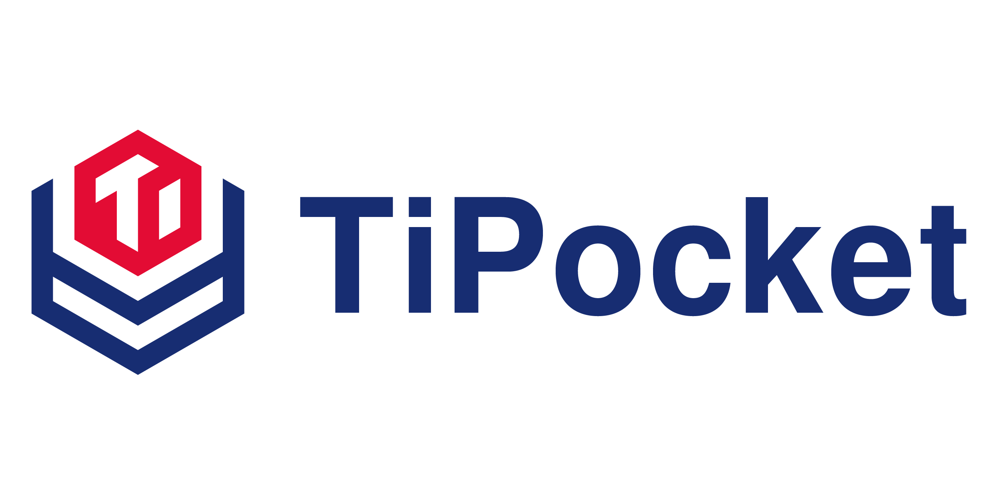

TiPocket is a testing toolkit designed to test TiDB, it encapsulates some testing tools which are also suitable for testing other databases.

TiPocket is inspired by [jepsen-io/jepsen](https://github.com/jepsen-io/jepsen), a famous library on the distributed system field. TiPocket focuses on stability testing on TiDB, it uses [chaos-mesh](https://github.com/pingcap/chaos-mesh) to inject all-round kinds of nemesis on a TiDB cluster.

## Requirements

* [TiDB Operator](https://github.com/pingcap/tidb-operator) >= v1.1.9

* [Chaos Mesh](https://github.com/pingcap/chaos-mesh) >= v1.1.0

## Toolkit

* [go-sqlsmith](https://github.com/chaos-mesh/go-sqlsmith): go-sqlsmith is our Go implementation of sqlsmith, it's a fuzz-testing tool which can generate random MySQL-dialect SQL queries.
* [go-elle](https://github.com/pingcap/tipocket/tree/master/pkg/elle): Our Go port version of jepsen-io/elle, a general transactional consistency checker for black-box databases.

## Nemesis

* random_kill, all_kill, minor_kill, major_kill, kill_tikv_1node_5min, kill_pd_leader_5min: As their name implies, these nemeses inject unavailable in a specified period of time.
* short_kill_tikv_1node, short_kill_pd_leader: Kill selected container, used to inject short duration of unavailable fault.
* partition_one: Isolate single nodes
* scaling: Scale up/down TiDB/PD/TiKV nodes randomly
* shuffle-leader-scheduler/shuffle-region-scheduler/random-merge-scheduler: Just as there name implies
* ~~delay_tikv, delay_pd, errno_tikv, errno_pd, mixed_tikv, mixed_pd: Inject IO-related fault.~~
* small_skews, subcritical_skews, critical_skews, big_skews, huge_skews: Clock skew, small_skews ~100ms, subcritical_skews ~200ms, critical_skews ~250ms, big_skews ~500ms and huge_skews ~5s.

## Create a new case

run `make init c=$case`, for example:

```sh
$ make init c=demo
GO15VENDOREXPERIMENT="1" CGO_ENABLED=1 GOOS= GOARCH=amd64 GO111MODULE=on go build -ldflags '-s -w -X "github.com/pingcap/tipocket/pkg/test-infra/fixture.BuildTS=2021-02-05 07:13:54" -X "github.com/pingcap/tipocket/pkg/test-infra/fixture.BuildHash=a70411f45605864da28a5000aff72a226a1ab27f"'  -o bin/tipocket cmd/tipocket/*.go
bin/tipocket init -c demo
create a new case `demo`: testcase/demo
```

## Debug and Run

If you have a K8s cluster, you can use the below commands to deploy and run the case on a TiDB cluster.

### On a K8s cluster

```sh
make build
export KUBECONFIG=$(YOUR_KUBECONFIG_PATH)
bin/${testcase} -namespace=${ns} -hub=docker.io -image-version=nightly -purge=true -storage-class=local-path
```

### On the local environment

Another convenient way we recommend you is using tiup to deploy a cluster on local and use it to debug cases.

* Start a TiDB cluster

```sh
tiup playground --kv 3
```

* Specify that cluster address through `-tidb-server` `-tikv-server` and `-pd-server`

```bash
-tidb-server 127.0.0.1:4000 
```

* If a cluster has many service addresses, you can pass a flag multiple times

```bash
-tikv-server 127.0.0.1:20160 -tikv-server 127.0.0.1:20161
```

## Workloads

TiPocket includes some consistency, isolation and other kinds of tests

### Consistency

* **bank** transfers between rows of a shared table
* **pbank** check bank accounts using a linearizability checker [porcupine](https://github.com/anishathalye/porcupine)
* **vbank** like bank but cover more TiKV features
* **ledger** yet another bank test
* **rawkv-linearizability** rawkv linearizability checker
* **tpcc** use [go-tpc](https://github.com/pingcap/go-tpc) testing consistency

### Isolation

* **append** checks for dependency cycles in transactions using Elle
* **register** checks for write-read dependency cycles over read-write registers using Elle
