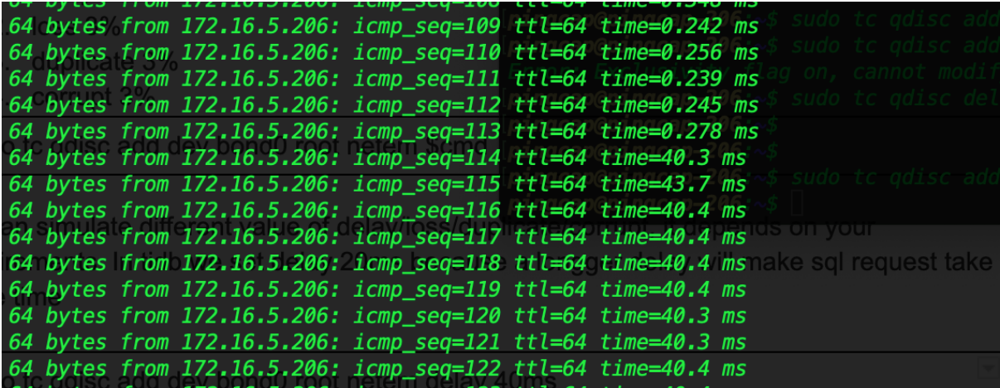
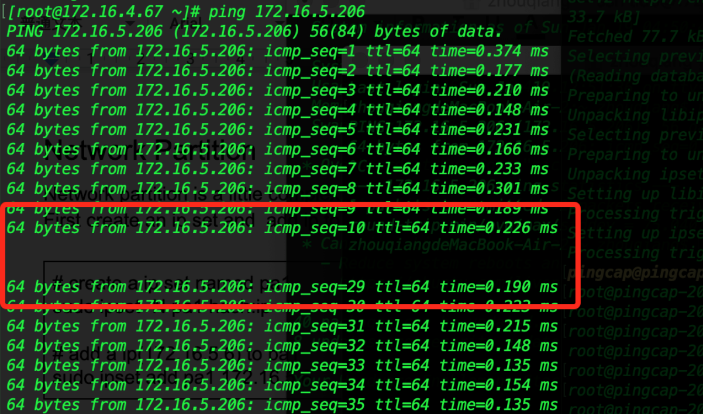
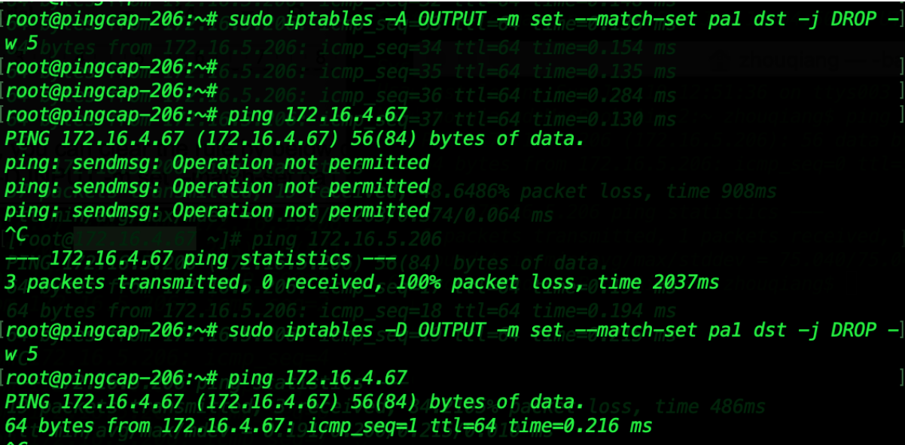
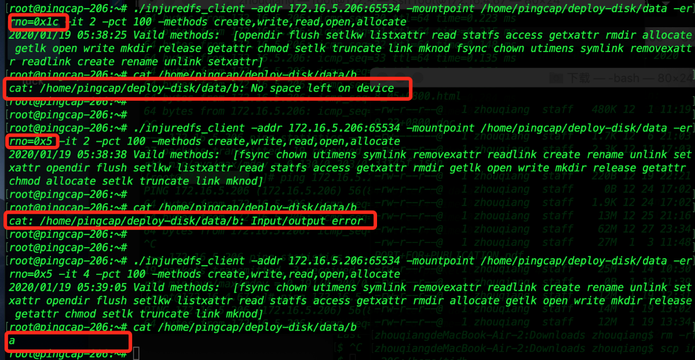

# Command Line Usages of Chaos
If  you deploy TiDB clusters with Ansible, Chaos Mesh is not applicable. In this case, you can still do chaos experiments using command line. This document walks you through the command usages of the typical chaos experiments. In the end, we provide a demo script to show a full chaos experiment using command line.

## kill process
The `kill process` chaos kills the specified process.The following example kills the tidb-server process:

`ps aux | grep tidb-server | awk ‘{print $2}’ | xargs kill -9`


## netem
The netem chaos simulates package delay/loss/duplicate/corruption over network. Assuming the network interface is “bond0”, use the following command to do Netem chaos: 

`sudo tc qdisc add dev bond0 root netem $cmd`

You can substitute the  $cmd argument with one of the following:
- delay 20ms
- loss 3%
- duplicate 3%  
- corrupt 3%

You can specify a degree value for the network delay/loss/duplicate/corruption based on your requirements. For example, delay 20ms simulates a network delay of 20ms.

Sample example:

`sudo tc qdisc add dev bond0 root netem delay 40ms`



When you complete the experiment, use the following command to clear it:

`sudo tc qdisc del dev bond0 roots`

## network partition
The network partition chaos uses [ipset](http://ipset.netfilter.org/) and [iptables](https://en.wikipedia.org/wiki/Iptables) to simulate network partition. 
<bold>To inject network partition chaos</bold>:

1. Create an IP set and add IP to it.
```
# create a ip set named “pa1”
sudo ipset -N pa1 hash:ip

# add aN ip(172.16.4.67) to “pa1”
sudo ipset add pa1 172.16.4.67
```
2. Set the incoming rule or outcoming rule as desired:
    - Set incoming rule:
    ```
    # add the incoming rule to drop all packets from the source IP set of “pa1”
    sudo iptables -A INPUT -m set --match-set pa1 src -j DROP -w 5

    # if chaos finishes, clear the rule using:
    sudo iptables -D INPUT -m set --match-set pa1 src -j DROP -w 5
    ```
    

    - Set outcoming rule:
    ```
    # set the outcoming rule to drop all packets sent to the destination IP set of “pa1”
    sudo iptables -A OUTPUT -m set --match-set pa1 dst -j DROP -w 5

    # if chaos finishes, clear the rule using:
    sudo iptables -D OUTPUT -m set --match-set pa1 dst -j DROP -w 5
    ```
    

## I/O chaos
I/O chaos injects I/O delay and I/O errors such as “No space left in device” and “No such file”. I/O chaos injection requires two binaries—- [injuredfs](../static/injuredfs) (I/O inject server) and [injuredfs_client](../static/injuredfs_client) (I/O inject client). For more information on the injection methods and errors, refer to [Chaos Mesh documentation](https://github.com/pingcap/chaos-mesh/blob/master/doc/io_chaos.md#common-linux-system-errors).

<bold>To do I/O chaos</bold> (using TiKV as an example):
1. Initialize the target file system (fs) for chaos:
```
# install fs chaos server (the server name is injuredfs). Make sure you have fuse in your environment

sudo su -
systemctl stop tikv-20160.service
mv /tidata01/tidb/deploy/data /tidata01/tidb/deploy/data_origin
chmod +x injuredfs && mkdir -p /tidata01/tidb/deploy/data
nohup ./injuredfs -original /tidata01/tidb/deploy/data_origin -mountpoint /tidata01/tidb/deploy/data &

# start tikv
systemctl start tikv-20160.service
```
2. Inject I/O chaos.
### To inject IO delay and clear:
```
./injuredfs_client -addr 21.1.205.205:65534 -mountpoint /tidata01/tidb/deploy/data -delay 30000 -it 2 -methods create,write,read,open,allocate

./injuredfs_client -addr 21.1.205.205:65534 -mountpoint /tidata01/tidb/deploy/data -delay 30000 -it 4 -methods create,write,read,open,allocate
```
### To inject I/O error and clear:
```
# inject  I/O error (errno = 5)
chmod +x injuredfs_client
./injuredfs_client -addr 21.1.205.205:65534 -mountpoint /tidata01/tidb/deploy/data -errno=5 -it 2 -methods create,write,read,open,allocate

# clear I/O error
./injuredfs_client -addr 21.1.205.205:65534 -mountpoint /tidata01/tidb/deploy/data -errno=5 -it 4 -methods create,write,read,open,allocate
```

Sample output for I/O error chaos:


## time jump
The time jump chaos makes time jump forward or backward to inject time sync errors.
<bold>To inject time jump chaos</bold>:
```
sudo service ntp stop # stop the ntp service first
sudo date +%T -s "11:14:00"
```

## A demo for random network chaos
In this demo shell script, we continuously inject netem chaos randomly into one of the three machines:
network_chaos.sh
```
while true
do
    ip=`python select_ip.py`
    cmd=`python select_cmd.py`
 
    echo `date`": start command: sudo tc qdisc add dev bond0 root netem $cmd on $ip"
    ssh $ip "sudo tc qdisc add dev bond0 root netem $cmd"
 
    sleep 90

    echo `date`": start command: sudo tc qdisc del dev bond0 root on $ip"
    ssh $ip "sudo tc qdisc del dev bond0 root"
 
    sleep 90
done
```

select_ip.py
```
import random
ips = [
    "1.1.1.1",
    "1.1.1.2",
    "1.1.1.3",
]
 
if __name__ == "__main__":
    index = random.randint(0,2)
    print ips[index]
```

select_cmd.py
```
import random
command = [
    "delay 20ms",
    "loss 3%",
    "duplicate 3%",
    "corrupt 3%"
]
if __name__ == "__main__":
    index = random.randint(0,3)
    print command[index]
```
